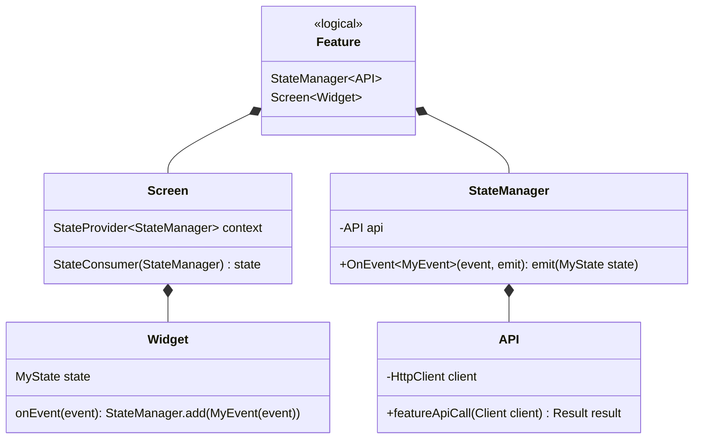
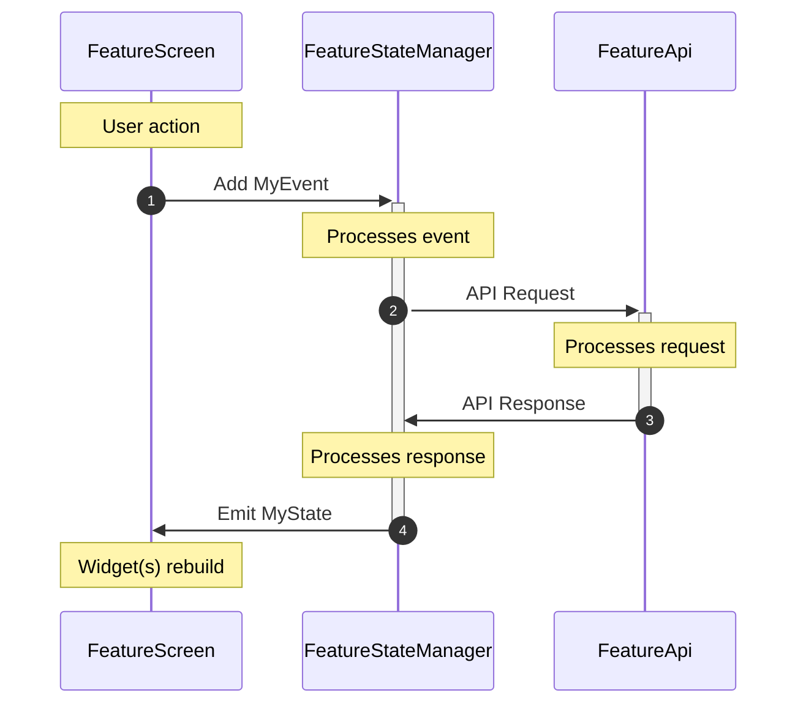

# Application Architecture Using Arcane

## Contents

- [Application Architecture Using Arcane](#application-architecture-using-arcane)
  - [Contents](#contents)
  - [Overview](#overview)
    - [Slides](#slides)
    - [Implementations](#implementations)
  - [Features](#features)
    - [Overview](#overview-1)
    - [Screen(s)](#screens)
    - [State Management](#state-management)
    - [Feature API](#feature-api)
  - [Services](#services)
    - [Service Provider](#service-provider)
    - [Example Service](#example-service)
  - [Logging](#logging)
    - [Creating a Logging Interface](#creating-a-logging-interface)
    - [Registering Logging Interfaces](#registering-logging-interfaces)
    - [When, Where, What, and How to Log Events](#when-where-what-and-how-to-log-events)
  - [Secrets and Configuration](#secrets-and-configuration)
    - [Secrets](#secrets)
      - [Accessing Secrets](#accessing-secrets)
    - [Configuration](#configuration)
  - [Dependency Injection](#dependency-injection)
  - [HTTP Client](#http-client)
    - [Client Interface](#client-interface)
    - [Dio Helper](#dio-helper)
    - [Interceptors](#interceptors)
      - [Authorization Interceptor](#authorization-interceptor)
      - [Connectivity Interceptor](#connectivity-interceptor)
  - [Routing](#routing)
    - [Defining Available Routes](#defining-available-routes)
    - [Redirection Handling](#redirection-handling)
    - [The Router](#the-router)
      - [Using the Router](#using-the-router)
      - [Redirecting Upon Logout](#redirecting-upon-logout)
  - [App Scaffolding](#app-scaffolding)
      - [AppScaffoldShell](#appscaffoldshell)
    - [AppScaffold](#appscaffold)
  - [Theming and Styling](#theming-and-styling)
    - [Defining the Theme and Theme Parts](#defining-the-theme-and-theme-parts)
    - [Defining the Application Colors](#defining-the-application-colors)
    - [Applying the Theme](#applying-the-theme)
  - [Authentication](#authentication)
    - [Authentication Interfaces](#authentication-interfaces)
      - [Registering Authentication Interfaces](#registering-authentication-interfaces)
    - [Logging in and out](#logging-in-and-out)
      - [Logging In](#logging-in)
      - [Logging Out](#logging-out)

## Overview

This architecture has been designed in such a way that it will be easy to maintain, extend, and understand the inner-workings of. Logically, it has been separated into a number of _features_. The styling of the application is primarily orchestrated via the application's [`Theme`](#theming-and-styling), which consists of a light mode, a dark mode, and tooling to gracefully switch between modes either automatically or manually.

This architecture uses the Arcane (**A**gnostic **R**eusable **C**omponent **A**rchitecture for **N**ew **E**cosystems) Framework found in the [arcane_framework](https://pub.dev/packages/arcane_framework) package, which was created by Hans Kokx.

The logical layout of the application is defined in Figure 1:


Figure 1: Logical architecture layout

A simplified version of the diagram can be found in Figure 2:


Figure 2: Logical architecture layout (simplified)

### Slides

For slides that present this architecture, please click [here](https://docs.google.com/presentation/d/1324qUQ19uyAPO83Cn2mRgnQYMpt9zFZqFm3s3raPddo/edit?usp=sharing).

Slides: [Application Architecture.pptx](https://github.com/user-attachments/files/18379060/Application.Architecture.pptx)

### Implementations

I have created a repo for some implementations of the things described in this document. Feel free to use, adapt, and contribute to the code in the [repo](https://github.com/hanskokx/arcane_implementations).

## Features

Applications are composed of features. Features are the building blocks of an application's functionality. They encapsulate specific capabilities or modules that work together to create the overall user experience. Each feature is designed to be self-contained, promoting modularity and easier maintenance. This approach allows developers to work on individual features without affecting the entire application, facilitating parallel development and easier testing.

### Overview

A **feature** _generally_ consists of the following components:

- One or more [screens](#Screen(s)) that a user can navigate to
- A [state management](#state-management) solution (which could be `Bloc`, `RiverPod`, `Provider`, or anything else)
- An [API](#feature-api) to communicate with external services, either on the device (e.g., with Bluetooth devices) or on the internet (e.g., and external API/backend via GraphQL, REST, gRPC, etc.)

> [!WARNING]
> No feature should communicate with or depend upon any other feature directly. Inter-feature communication should only occur via services.

Therefore, a **feature** can generally be defined as:



As a user performs actions in the UI, events will be sent to the [state management](#state-management). When the state manager receives an event, it may emit a `Waiting` state, causing the UI to rebuild and indicate that the action is currently being performed. Then, the state manager will make a call to the feature's [API](#feature-api) to fulfill the request. Once the API has completed the request, either successfully or unsuccessfully, response is then returned to the state manager for further processing. A new state will be emitted from the state manager to indicate a success or failure state, and again the UI will rebuild to indicate the result. This process can be visualized in the following manner:



### Screen(s)

Each feature will contain one or more screens. For _most_ features, the screen will be some sort of `Scaffold` with a [state consumer](#state-management) that dictates the current state of the widget(s). The screen is where a user will interact with the application. User and automated actions trigger events to be sent to the state manager, which in turns communicates to the backend via the [API](#feature-api).

### State Management

This architecture is _state management agnostic_, meaning that any state management solution is compatible, including mixing and matching different state management solutions. However, it has been primarily designed around and tested/used in production with the [bloc](https://bloclibrary.dev/) library.

A single state manager is created for each feature, which is then registered into a top-level state provider. Each state provider communicates with external services via a feature-level [API](#feature-api), which is provided via [dependency injection](#dependency-injection).

### Feature API

Each feature will (typically) have an API. The API, which is registered in the [dependency injection](#dependency-injection) system, communicates with external services and APIs (e.g., Bluetooth or the backend). The response returned from every call to the API is always a [`Result`](https://pub.dev/packages/result_monad) monad.

> [!TIP]
> A `monad` is a design pattern in functional programming that encapsulates computations and their potential side effects. In this context, it refers to a structure that wraps the result of an operation, allowing for cleaner error handling and chaining of operations.

The API _generally_ uses the [HTTP Client](#http-client) to communicate with the backend, which [automatically manages authentication tokens](#authorization-interceptor).

## Services

A **service** is a singleton that is used to store information which multiple features may care about. Notably, a service _does not_ perform complex logic - it (optionally) sets values and notifies listeners of changes to those values or simply performs some action that isn’t specific to a single feature.

> [!TIP]
> A singleton is a software design pattern where a class has only one instance that is globally accessible throughout the application. It ensures a single point of control for a shared resource or service.

There are (generally speaking) two types of services: _basic_ services and _advanced_ services. Basic services hold a piece of data that is available throughout the application, while an advanced service may perform more complex logic.

To facilitate easier use of services, I have created a package on [pub.dev](https://pub.dev/packages/arcane_framework) called [arcane_framework](https://pub.dev/packages/arcane_framework). Some services have been built into the [arcane_framework](https://pub.dev/packages/arcane_framework), such as the `AuthenticationService` and the `FeatureFlagService`.

### Service Provider

Arcane provides access to `ArcaneService` instances via `BuildContext` using the `ArcaneServiceProvider`. This means that accessing an `ArcaneService`'s values via `BuildContext` provides an inherent `ChangeNotifier` - when a value is updated, widgets using that value will automatically be rebuilt.

For more details, refer to the [official documentation](https://pub.dev/packages/arcane_framework#services). More information about services can be found in the [Example Service](#example-service) section.

Note that registering your service instances in `Arcane` isn’t strictly necessary to use `ArcaneService`s but it does make using them much more convenient. For example:

```dart
// Example code - not production ready!
// GOOD example:

void main() {
 runApp(
  ArcaneApp(
   services: [
    FavoriteService.I,
   ],
   child: MyApp(...),
  ),
 );
}

class MyWidget extends StatelessWidget {
  const MyWidget({super.key});

  @override
  Widget build(BuildContext context) {
    return AnimatedCrossFade(
      firstChild: const Icon(Icons.star),
      secondChild: const Icon(Icons.star_border),
      duration: const Duration(milliseconds: 200),
      crossFadeState:
          context.serviceOfType<FavoriteService>()?.isFavorite == true
              ? CrossFadeState.showFirst
              : CrossFadeState.showSecond,
    );
  }
}
```

Note how this widget becomes a `StatelessWidget` when using `Arcane`. Without it, your widget becomes an unwieldy `StatefulWidget`:

```dart

// Example code - not production ready!
// BAD example:
class MyWidget extends StatefulWidget {
  const MyWidget({
    super.key,
  });

  @override
  State<MyWidget> createState() => _MyWidgetState();
}

class _MyWidgetState extends State<MyWidget> {
  bool? isFavorite = FavoriteService.I.isFavorite;

  @override
  Widget build(BuildContext context) {
    return AnimatedCrossFade(
      firstChild: const Icon(Icons.star),
      secondChild: const Icon(Icons.star_border),
      duration: const Duration(milliseconds: 200),
      crossFadeState: isFavorite == true
          ? CrossFadeState.showFirst
          : CrossFadeState.showSecond,
    );
  }

  @override
  void initState() {
    super.initState();
    FavoriteService.I.addListener(_listener);
  }

  @override
  void dispose() {
    FavoriteService.I.removeListener(_listener);
    super.dispose();
  }

  Future<void> _listener() async {
    setState(() {
      isFavorite = FavoriteService.I.isFavorite;
    });
  }
}
```

### Example Service

An example service is the `FavoriteColorService`:

```dart
class FavoriteColorService extends ArcaneService {
  static final FavoriteColorService _instance = FavoriteColorService._internal();
  static FavoriteColorService get I => _instance;
  FavoriteColorService._internal();

  Color? _myFavoriteColor;
  Color? get myFavoriteColor => _myFavoriteColor;

  void setMyFavoriteColor(Color? newValue) {
    _myFavoriteColor = newValue;
    notifyListeners();
  }
}
```

This service’s purpose is to store and provide access to a user’s favorite color. Importantly, it does not have an opinion on _how_ the favorite color is chosen (such as by retrieving the value from the backend) or _what_ consumes the value.

## Logging

Whether it’s aiding in development or providing analytics and insights during production, logging is vital to every application. `Arcane` offers a mechanism by which logs can be sent to multiple logging interfaces, simply requiring the interface to be created (or reused) and registered with `Arcane`.

### Creating a Logging Interface

A logging interface is what `Arcane` uses to pass log events into. In its simplest form, it could simply be an interface to `debugPrint()`:

```dart
class DebugPrint implements LoggingInterface {
  DebugPrint._internal();
  static final DebugPrint _instance = DebugPrint._internal();
  static DebugPrint get I => _instance;

  @override
  bool get initialized => true;

  @override
  void log(
    String message, {
    Map<String, dynamic>? metadata,
    Level? level,
    StackTrace? stackTrace,
  }) {
    debugPrint(message);
  }

  @override
  Future<LoggingInterface?> init() async => I;
}
```

In practice, your logging interface will likely be slightly more complex.

Often, clients require logs to be sent to an external logging provider, such as DataDog, NewRelic, or any number of other providers. In this case, a second logging interface can be defined to integrate with the third-party solution:

```dart
// Note: requires the relevant Feature enum values to be registered
// within Arcane.
class NewRelic implements LoggingInterface {
  static final NewRelic _instance = NewRelic._internal();
  static NewRelic get I => _instance;

  bool _initialized = false;
  @override
  bool get initialized => I._initialized;

  NewRelic._internal();

  @override
  void log(
    String message, {
    Map<String, dynamic>? metadata,
    Level? level,
    StackTrace? stackTrace,
  }) {
    final Map<String, dynamic> metadataToSend = metadata ?? {};

    // New Relic strips this out, anyway, so let's not cause additional logs.
    metadataToSend.removeWhere((key, _) => key == "timestamp");

    // Add the logging level to the metadata
    metadataToSend.putIfAbsent(
      "level",
      () => (level?.name ?? "debug").capitalize,
    );

    NewrelicMobile.instance.recordCustomEvent(
      "App",
      eventName: message,
      eventAttributes: metadataToSend,
    );

    if (stackTrace != null) {
      NewrelicMobile.instance.recordError(message, stackTrace);
    }
  }

  @override
  Future<NewRelic?> init() async {
    if (initialized) return I;

    final String appToken = AppEnv.valueOf(
      Platform.isAndroid
          ? EnvVar.newRelicAppTokenAndroid
          : EnvVar.newRelicAppTokenIos,
    );

    final Config config = Config(
      accessToken: appToken,
    );

    await NewrelicMobile.instance.startAgent(config);

    // Initialization complete.
    I._initialized = true;

    return I;
  }
}
```

### Registering Logging Interfaces

Once one (or more) logging interfaces have been created and are ready to use, they need to be registered within `Arcane`.

```dart
Future<void> main() async {
 WidgetsFlutterBinding.ensureInitialized();

   await Arcane.logger.registerInterfaces([
  // Register the debug console logging interface
     DebugConsole.I,
     // Register the New Relic logging interface
  NewRelic.I,
 ]);

 // Initialize registered logging interfaces
 // NOTE: This step may be deferred until a user has consented to app tracking.
 await Arcane.logger.initializeInterfaces();

 // Alternatively, interfaces may be initialized independently:
 await NewRelic.I.init();

 runApp(MyApp());
}
```

### When, Where, What, and How to Log Events

Sometimes, it will be desirable or necessary to include additional metadata in log messages, to aid in troubleshooting and to coordinate multiple log events into a cohesive series of events. To accomplish this, `Arcane` allows for adding persistent metadata that will be passed to each registered logging interface whenever a log message is sent:

```dart
// Add metadata to the logger
Arcane.logger.addPersistentMetadata({
  "install_id": "aaa",
  "session_id": "bbb",
});
```

Logging messages using `Arcane` requires that at least one logging interface has been registered. Once a logging interface has been registered, you can call `Arcane.log()` to send a log message to all registered interfaces.

```dart
Arcane.log("Hi mom!");
```

However, a logging interface _can_ be used directly without the use of `Arcane`. In that event, the interface would need to be initialized and invoked independently, and the persistent metadata system would not be available:

```dart
await NewRelic.I.init();

NewRelic.I.log(
 "Hi mom!",
 metadata: {
   "install_id": "aaa",
   "session_id": "bbb",
 },
);
```

`Arcane`’s logging system offers a number of options to fine-tune log messages, so be sure to look at the [available options](https://pub.dev/packages/arcane_framework#logging).

Debug logging is a fine art. In general, it’s better to log _too many_ messages than _too few_. When a user taps a button, capture the event. When the [state management](#state-management) begins processing a request, capture the event. When the [API](#feature-api) starts processing a request, capture the event. When a result is determined, capture the event. Capture as much data as is useful for somebody to come back through later and determine exactly what sequence of events led to a particular outcome.

The key in logging is to as accurately as possible label the severity of each log event. When you begin processing an event, there might not be any useful information to capture yet, so you might log the event as `Level.debug`. When an event is processed successfully, you might want to make note of it with `Level.info`. When something fails, perhaps a `Level.error` is more appropriate.

Once logs are being sent at the appropriate log level, you can go back and filter them out. Adding some code to your logging interface can do this for you:

```dart
const Level cutoff = AppConfig.debugLoggingThreshold;
if ((level?.value ?? Level.debug.value) < cutoff.value) return;
```

## Secrets and Configuration

Secrets are used to define compile-time variables (such as API tokens and backend URLs), while the configuration is used to define runtime variables that may change in the future.

### Secrets

Secrets used by the application are accessed via environment variables. This accomplishes a number of goals simultaneously:

1. Environment variables can either be set per-machine (e.g., on each developer’s computer) or via some other mechanism (e.g., GitHub Secrets). This means that secrets can remain _secret._
2. Different sets of environment variables can define different configurations for the application. While your CI/CD pipeline should (almost) always use production environment variables, you may want your development machine to have access to production, development, and staging environments.
3. Leveraging environment variables makes your code much cleaner and simpler - you only have to write code for a single environment.

> [!TIP]
> Environment variables are configuration settings stored outside the application code. They're typically used to manage sensitive information—such as API keys—or to specify different configurations for various deployment environments (e.g., development, staging, production).

On a developer’s computer, environment variables are stored in `.env` files - one for each configuration (e.g., `.env.dev`, `.env.release`, etc.) and are _not_ checked into source control. Your application will read in variables from the `.env` file (which will be written to during a CI/CD build pipeline), so switching environments is as simple as copying the appropriate file to `.env`. To facilitate reading this file from the application, it should be included in the `assets` directory, such as `my_app/assets/.env`, with the `assets` directory included in `pubspec.yaml`.

To facilitate this and make it as simple as possible for developers, a `Makefile` can be used:

```makefile
env ?= default
.PHONY: change-env
change-variant:
 (cp assets/.env.$(env) assets/.env)
```

When switching to a new environment, the developer can simply run the following command:

```bash
env=prod make change-env
```

This would copy `.env.prod` to `.env`. By default, running the command without specifying an environment will use the `.env.default` file. In this way, an infinite number of environments could be created and easily switched between.

#### Accessing Secrets

Accessing the secrets defined in the environment variables can be done via the `AppEnv`, provided they have been mapped to a corresponding `EnvVar` enum item:

```dart
import 'package:arcane_framework/arcane_framework.dart';
import 'package:flutter_dotenv/flutter_dotenv.dart';

abstract class AppEnv {
 /// Fetches the environment variable value for the given [EnvVar]. If the
 /// value is not set, defaults to an empty string.
 static String? valueOf(EnvVar val) {
  if (!dotenv.isInitialized) return null;
  if (!dotenv.isEveryDefined([val.key])) return null;
 
  return dotenv.maybeGet(val.key);
 }
 
 /// Returns [true] if all of the [EnvVar] variables are set.
 static bool get hasEnv {
  try {
   return dotenv.isEveryDefined(EnvVar.values.map((e) => e.key).toList());
  } catch (_) {
   return false;
  }
 }
 
   
 
 static Future<void> init() async {
  if (dotenv.isInitialized) return;
  
  try {
   await dotenv.load(
    fileName: 'assets/.env',
    isOptional: true,
   );
  } catch (e) {
   Arcane.log(
    'Error loading .env file',
    level: Level.error,
   );
  }
 }
}

enum EnvVar {
  /// The environment to use for the API calls.
  ///
  /// Example `.env` configuration:
  /// ```
  /// API_ENVIRONMENT="dev"
  /// ```
  apiEnvironment("API_ENVIRONMENT"),
  ;

  /// The environment variable to use when retrieving the value of this [EnvVar].
  final String key;

  /// The value of the [EnvVar] as a string. If the environment variable is not
  /// set, returns an empty string.
  String get value => AppEnv.valueOf(this);

  const EnvVar(this.key);
}
```

### Configuration

An application's configuration should centralize values that may change in the future, placing them in an easily accessible location. Examples may include:

- A support URL that users can access in the application
- The threshold at which logs are displayed in the debug console (e.g., setting a threshold of `Level.info` would prevent logs with a `Level.debug` from being printed to the debug console.)
- A variable the customer may ask to have changed, such as the duration of a timer

Specifying each of these values in an abstract class, then referencing the values via the class, allows the developer to quickly respond to change requests from customers.

```dart
// Production ready code!
abstract class AppConfig {
  /// Sets the minimum threshold for logging message to the debug console
  static const debugLoggingThreshold = Level.info;
}
```

As a matter of convenience, a `config.dart` file can be created adjacent to your `main.dart` which contains this `AppConfig` class. Also in this file, it’s recommended to place your `Feature` enum (see [Basic Services](#Basic-Services)) and your `EnvVar` enum (see [Secrets](#secrets)).

## Dependency Injection

This architecture utilizes a dependency injection (DI) solution, such as [GetIt](https://pub.dev/packages/get_it).

> [!TIP]
> Dependency injection is a software design pattern where a class receives its dependencies from external sources rather than creating them itself. This technique promotes loose coupling, easier testing, and improved modularity in software development.

When creating an instance of a state management provider, retrieve the corresponding [API](#feature-api) from the dependency injection (DI) system. This approach enables dynamic loading and unloading of different APIs during runtime. For example, in a "demo" mode, logging in as a demo account could trigger the replacement of production APIs with dummy APIs that return fixed data.

The dependency injection system also allows for easier testing, as dependencies can be mocked or replaced with stubs, and it decouples the [state management](#state-management) from the APIs.

> [!TIP]
> Stubs are simplified implementations of components or functions used in software testing. They provide predefined responses to specific inputs, allowing developers to test parts of a system in isolation without relying on the actual, complex implementations.

In addition, an [HTTP client](#http-client) may be registered as needed in the DI solution, allowing for a single client to retain authentication headers across multiple features.

## HTTP Client

The HTTP Client is used by [feature APIs](#feature-api), automatically manages authentication headers, and consists of several parts:

- A client interface, such as an `AppGraphQLClient`, `AppHTTPClient`, and/or a client for any other type of communication.
- The `DioHelper`
- The `AuthorizationInterceptor`

While this architecture has been developed and tested using [`Dio`](https://pub.dev/packages/dio), it could be implemented using any other capable HTTP Client. It just so happens that [`Dio`](https://pub.dev/packages/dio) provides all of the necessary functionality out-of-the-box.

### Client Interface

The client interface provides an interface to the the [Dio](https://pub.dev/packages/dio) instance that is registered within the [dependency injection](#dependency-injection) system when the [DioHelper](#dio-helper) is instantiated. When a [feature’s API](#feature-api) communicates externally, it does so via this client interface.

```dart
// This is an example of a GraphQL client

import "package:arcane_framework/arcane_framework.dart";
import "package:dio/dio.dart";
import "package:flutter/foundation.dart";
import "package:flutter_dotenv/flutter_dotenv.dart";
import "package:gql_dio_link/gql_dio_link.dart";
import "package:graphql/client.dart";

class AppGraphQlClient {
  static final AppGraphQlClient _service = AppGraphQlClient._internal();

  factory AppGraphQlClient() => _service;

  AppGraphQlClient._internal();

  static GraphQLClient? _graphQlClient;
  static GraphQLClient get graphQlClient {
    if (_graphQlClient == null) throw NotInitializedError();
    return _graphQlClient!;
  }

  static GraphQLClient? _webSocketClient;
  static GraphQLClient get webSocketClient {
    if (_webSocketClient == null) throw NotInitializedError();
    return _webSocketClient!;
  }

  @visibleForTesting
  static void setMocked() => _isMocked = true;

  static Future<void> init(Dio dio, {String? url}) async {
    final String? authToken = await Arcane.auth.accessToken;

    _webSocketClient = GraphQLClient(
      cache: GraphQLCache(),
      queryRequestTimeout: const Duration(seconds: 40),
      defaultPolicies: DefaultPolicies(
        query: Policies(
          fetch: FetchPolicy.networkOnly,
        ),
      ),
      link: WebSocketLink(
        "wss://$url",
        config: SocketClientConfig(
          autoReconnect: true,
          initialPayload: {
            "Authorization": "Bearer $authToken",
          },
        ),
        subProtocol: GraphQLProtocol.graphqlTransportWs,
      ),
    );

    _graphQlClient = GraphQLClient(
      cache: GraphQLCache(),
      queryRequestTimeout: const Duration(seconds: 40),
      defaultPolicies: DefaultPolicies(
        query: Policies(
          fetch: FetchPolicy.networkOnly,
        ),
      ),
      link: DioLink(
        "https://$url",
        client: dio,
      ),
    );
  }
}

extension QueryResultExtension on QueryResult {
  int get errorStatusCode {
    if (exception?.linkException != null &&
        exception!.linkException is HttpLinkServerException) {
      final HttpLinkServerException httpLinkException =
          exception!.linkException as HttpLinkServerException;
      return httpLinkException.response.statusCode;
    }
    return -1;
  }

  bool get failed {
    return !success;
  }

  bool get success {
    return !hasException && (data ?? const <dynamic, dynamic>{}).isNotEmpty;
  }
}
```

### Dio Helper

The `DioHelper` creates an instance of the [Dio](https://pub.dev/packages/dio) HTTP client. This is where the [authorization interceptor](#authorization-interceptor) is registered and where default values, such as the [base URL](#secrets-and-configuration) and timeout values are set. The `DioHelper` is only invoked from within the [dependency injection](#dependency-injection) system, where the [Dio](https://pub.dev/packages/dio) instance is created.

```dart
// file: dio_helper.dart
import "package:arcane_framework/arcane_framework.dart";
import "package:dio/dio.dart";
import "package:dio_smart_retry/dio_smart_retry.dart";
import "package:native_dio_adapter/native_dio_adapter.dart";
import "package:pretty_dio_logger/pretty_dio_logger.dart";

import "authorization_interceptor.dart";
import "connectivity_interceptor.dart";

abstract class DioHelper {
  DioHelper._();

  static Dio createDioInstance() {
    // https://github.com/zino-hofmann/graphql-flutter/issues/1457
    final Dio dio = Dio(
      BaseOptions(
     // Sets the base URL for the backend API. In this instance, we're
     // setting it to a GraphQL endpoint via the EnvVar.
        baseUrl: "https://${EnvVar.graphQlUrl.value}",
        connectTimeout: const Duration(seconds: 10),
        sendTimeout: const Duration(seconds: 30),
        receiveTimeout: const Duration(seconds: 40),
        followRedirects: false,
      ),
    );

    dio.interceptors
      ..add(ConnectivityInterceptor())
      ..add(AuthorizationInterceptor())
      ..add(dioLogger)
      ..add(smartRetry(dio));

    dio.httpClientAdapter = NativeAdapter();

    return dio;
  }

  static Interceptor smartRetry(Dio dio) => RetryInterceptor(
        dio: dio,
        logPrint: Arcane.log,
        retries: 3,
        retryDelays: const [
          Duration(seconds: 1),
          Duration(seconds: 1),
          Duration(seconds: 1),
        ],
      );

  static PrettyDioLogger get dioLogger => PrettyDioLogger(
        requestHeader: true,
        requestBody: true,
        responseBody: true,
        responseHeader: false,
        error: true,
        compact: true,
        maxWidth: 90,
        enabled: Feature.httpLogging.enabled,
        filter: (options, args) {
          if (options.path.contains("/graphql")) {
            return true;
          }

          // don't print responses with unit8 list data
          return !args.isResponse || !args.hasUint8ListData;
        },
      );
}
```

### Interceptors

Interceptors are used to run code before and/or after a network request is made through the [client](#client-interface). Multiple interceptors can be added simultaneously. A couple of examples interceptors can be found in the following sections.

#### Authorization Interceptor

The `AuthorizationInterceptor` automatically manages the auth headers (often in the form of an OAuth2 bearer token). It is registered in the [dependency injection](#dependency-injection) system, and as an interceptor in the [DioHelper](#dio-helper). This is also where any additional headers can be (automatically) added to each HTTP request (such as a unique request ID, which is then also logged using a [logging service](#logging) to facilitate coordinating requests between the front-end and backend during troubleshooting).

```dart
// file: authorization_interceptor.dart
import "dart:developer";

import "package:arcane_framework/arcane_framework.dart";
import "package:arcane_helper_utils/arcane_helper_utils.dart";
import "package:dio/dio.dart";

class AuthorizationInterceptor extends Interceptor {
  AuthorizationInterceptor();

  @override
  Future<void> onRequest(
    RequestOptions options,
    RequestInterceptorHandler handler,
  ) async {
    if (options.path == EnvVar.accessTokenUrl.value) {
      return super.onRequest(options, handler);
    }

    final String? accessToken = await Arcane.auth.accessToken;

    // Logs the auth token to the debug console. Useful for debugging requests
    // using third-party tools where you need to authenticate. Only works if the
    // auth token isn't null and [Feature.debugPrintAuthToken] is enabled.
    if (accessToken != null && Feature.debugPrintAuthToken.enabled) {
      // Do not log the token anywhere other than a local console! Leaking this
      // would be considered a security risk.
      log("Token expires at ${accessToken.jwtExpiryTime()!.toIso8601String()}\n\n$accessToken");
    }

    // Assembles a Map of metadata that we're going to add to each HTTP request
    // so we can log out all the information in the debug console.
    final Map<String, String> metadata = {};

    // Attempts to map the "query" parameter in a GraphQL request to a String
    // so that we can log it out in the debug console.
    try {
      final Map<String, dynamic> query = options.data as Map<String, dynamic>;

      for (final MapEntry<String, dynamic> entry in query.entries) {
        if (entry.key == "query") {
          final String queryString = entry.value.toString();
          final int queryStringOriginalLength = queryString.length;
          const int trimQueryStringAtLength = 64;
          final int trimToLength =
              queryStringOriginalLength > trimQueryStringAtLength
                  ? trimQueryStringAtLength
                  : queryStringOriginalLength;
          final String finalString =
              "${queryString.substring(0, trimToLength)}${trimToLength < queryStringOriginalLength ? "[...]" : ""}";
          metadata.addAll({entry.key: finalString});
        }
      }
    } catch (e) {
      log(e.toString());
    }

    // Removes the extra query string from the headers so we're not sending it
    // to the server along with our request.
    metadata.removeWhere((key, value) => key == "query");

    // Tries to add the authentication token to the header metadata that we're
    // going to add to the request.
    if (accessToken.isNotNullOrEmpty) {
      metadata.addAll({"Authorization": "Bearer $accessToken"});
    }

    // Adds all the collected metadata (auth token, request ID, etc.) to the
    // request headers.
    options.headers.addAll(metadata);

    // Logs the HTTP request so we can see the request ID and truncated query
    // string (if available).
    final Map<String, String> logMetadata = Map<String, String>.from(metadata);
    logMetadata.remove("Authorization");
    Arcane.log(
      "Making HTTP Request ${options.path}",
      level: Level.info,
      metadata: logMetadata,
    );

    return super.onRequest(options, handler);
  }
}
```

#### Connectivity Interceptor

The `ConnectivityInterceptor` will automatically reject network requests if the device is offline.

```dart
// file: connectivity_interceptor.dart
import "package:connectivity_plus/connectivity_plus.dart";
import "package:dio/dio.dart";

class ConnectivityInterceptor extends Interceptor {
  @override
  Future<void> onRequest(
    RequestOptions options,
    RequestInterceptorHandler handler,
  ) async {
    final connectivityResult = await Connectivity().checkConnectivity();
    if (connectivityResult.contains(ConnectivityResult.none)) {
      return handler.reject(
        DioException.connectionError(
          requestOptions: options,
          reason: "Device is offline.",
        ),
      );
    }

    return super.onRequest(options, handler);
  }
}
```

## Routing

This architecture is _router agnostic_, meaning that any routing solution is compatible. However, it is recommended to leverage the power and flexibility of the [go_router](https://pub.dev/packages/go_router) package or a similar solution that implements the [Router API](https://api.flutter.dev/flutter/widgets/Router-class.html), at least until something better comes along.

Routing consists of several key pieces:

- A list of [available routes](#defining-available-routes)
- A way to [redirect unauthenticated users](#redirection-handling) who try to access protected routes
- [The router](#the-router) itself

### Defining Available Routes

A route consists of three pieces: the route _name_, the route _path_, and whether it is protected (e.g., requires the user to be authenticated) to access. To facilitate this, the `AppRoute` enum can be used. Its basic structure is as follows:

```dart
enum AppRoute {
 root("/", isProtected: false),
 splash("/splash", isProtected: false),

 // Welcome
 welcome("/welcome", isProtected: false),
 register("register", isProtected: false),
 login("login", isProtected: false),

 // Home
 home("/home"),

 final String path;
 final bool isProtected;

 const AppRoute(this.path, {this.isProtected = true});
}
```

This enum protects routes by default, requiring you to explicitly mark open routes. When navigating in the application, the enum value can be passed to GoRouter:

```dart
context.goNamed(AppRoute.login.name);
```

### Redirection Handling

When a user is not authenticated, they should not be able to access protected routes. Instead, they should be redirected to the login screen, or some other appropriate location. Additionally, the application should have some awareness of the route they were trying to access to send them back to that location after they’ve logged in (e.g., in the case of a deep-link.)

Since we’re already marking routes as protected in our [`AppRoute`](#defining-available-routes) enum, we can add a quick redirect check into GoRouter:

```dart
GoRouter(
  redirect: (BuildContext context, GoRouterState state) {
    final bool routeIsProtected = AppRoute.values.any(
      (AppRoute route) =>
          state.uri.toString().contains(route.path) && route.isProtected,
    );

    final bool unauthenticated =
        Arcane.auth.status == AuthenticationStatus.unauthenticated;

    if (unauthenticated && routeIsProtected) {
      return state.namedLocation(
        AppRoute.welcome.name,
        queryParameters: <String, String>{"from": state.uri.toString()},
      );
    }
    return null;
  },
);
```

> [!NOTE]
> Note that this calls into `Arcane` to determine the current authentication status.

### The Router

Our router is defined within the `AppRouter` class as a `static` value named `router`. Within it, we will define our GoRouter instance and its configuration. The configuration consists of several pieces, each should be relatively self-explanatory.

The basic structure of the class is as follows:

```dart
// NOT production ready code!
abstract class AppRouter {
  static final router = GoRouter(
    errorBuilder: (context, state) => const ErrorScreen(),
    navigatorKey: GlobalKey<NavigatorState>(debugLabel: "root"),
    initialLocation: AppRoute.splash.path,
    debugLogDiagnostics: kDebugMode,
    redirect: ... // See the Redirection Handling section,
    routes: <RouteBase>[
      GoRoute(
        path: AppRoute.root.path,
        redirect: (_, __) => AppRoute.home.path,
      ),
      // * Splash Screen
      GoRoute(
        name: AppRoute.splash.name,
        path: AppRoute.splash.path,
        pageBuilder: (context, state) {
          context.read<WelcomeBloc>().add(Init());
          final String? from = state.uri.queryParameters.entries
              .firstWhereOrNull((element) => element.key == "from")
              ?.value;
          return MaterialPage(
            key: state.pageKey,
            child: SplashScreen(from: from),
          );
        },
      ),
      
      // * Welcome
      GoRoute(
        name: AppRoute.welcome.name,
        path: AppRoute.welcome.path,
        pageBuilder: (context, state) => MaterialPage(
          key: state.pageKey,
          child: const WelcomeScreen(),
        ),
      ),
      
      // * Main Screen
      StatefulShellRoute.indexedStack(
       // Note the `AppScaffoldShell` widget. See the App Scaffold
       // section for more details.
        builder: (context, state, navigationShell) => AppScaffoldShell(
          key: ValueKey(context.watch<ArcaneEnvironment>().state.name),
          navigationShell: navigationShell,
        ),
        branches: <StatefulShellBranch>[
          // Home branch
          StatefulShellBranch(
            initialLocation: AppRoute.home.path,
            navigatorKey: GlobalKey<NavigatorState>(debugLabel: "home"),
            routes: [
              GoRoute(
                name: AppRoute.home.name,
                path: AppRoute.home.path,
                pageBuilder: (context, state) {
                  return NoTransitionPage(
                    child: AppScaffold(
                      key: state.pageKey,
                      body: HomeScreen(
                        key: GlobalKey(debugLabel: "Home Screen"),
                      ),
                    ),
                  );
                },
              ),
            ],
          ),
     ],
      ),
    ],
  );
}
```

#### Using the Router

Once the router has been created, you’ll need to add it to the application. This is done in `main.dart` within the top-level Widget:

```dart
// NOT production ready code!

class MainApp extends StatelessWidget {
  const MainApp({super.key});

  @override
  Widget build(BuildContext context) {
    return ArcaneApp(
      child: MaterialApp.router(
        routeInformationProvider: AppRouter.router.routeInformationProvider,
        routeInformationParser: AppRouter.router.routeInformationParser,
        routerDelegate: AppRouter.router.routerDelegate,
        // Some parameters removed for brevity
      ),
    );
  }
}
```

When navigating throughout the application, use GoRouter’s built-in `context` extension(s), such as:

```dart
context.go(AppRoute.myRoute.path);
// or
context.goNamed(AppRoute.myRoute.name);
// or
context.pushNamed(AppRoute.myRoute.name);
// or
context.pushReplacementNamed(AppRoute.myRoute.name);
// etc.
```

#### Redirecting Upon Logout

When the user logs out, they should be redirected back to the login screen. We can accomplish this by adding a method to our [`AppRouter`](#the-router) class that performs the logout functions and then redirects us when done. For more information, see [Authentication](#authentication).

```dart
abstract class AppRouter {
  static Future<void> logout(BuildContext context) {
    return Arcane.auth.logOut(
      onLoggedOut: () async {
        // Perform any cleanup necessary in the application
        await AppInjector.init().whenComplete(() {
          try {
            final Dio dio = GetIt.I.get<Dio>();
            dio.close(force: true);
          } catch (e) {
            Arcane.log(
             "Unable to close Dio connections when logging out.",
             level: Level.error,
             metadata: {
              "error": "$e",
             },
            );
          }
          // Redirect back to the root route
          AppRouter.router.go("/");
        });
      },
    );
  }
}
```

When logging out of the application, to ensure a redirect we can call the [`AppRouter`](#the-router)’s `logout` method:

```dart
AppRouter.logout(context);
```

## App Scaffolding

Every application’s requirements are different, so the specific implementation of the `AppScaffold` will likely differ from project to project. However, the following solution leverages the [custom_adaptive_scaffold](https://pub.dev/packages/custom_adaptive_scaffold) package to provide simple navigation and screen size reactivity to your application. This solution also maintains state and the navigation stack for each tab when switching between tabs.

The App Scaffold consists of two parts:

1. The [`AppScaffoldShell`](#appscaffoldshell) widget
2. The `AppScaffold` widget

Video 1 showcases (approximately) what it looks like in action:

https://github.com/user-attachments/assets/c477705d-ba44-487b-a907-0fc7d89222f0

Video 1: an example implementation of the custom_adaptive_scaffold (in this example, [flutter_adaptive_scaffold](https://pub.dev/packages/flutter_adaptive_scaffold) is used, instead, which is what custom_adaptive_scaffold is based on).


#### AppScaffoldShell

The `AppScaffoldShell` widget is used to provide the navigation options to the user. This includes a tab bar (in phone layouts) and a sidebar on larger screens.

```dart
import "package:flutter/material.dart";
import "package:flutter_adaptive_scaffold/flutter_adaptive_scaffold.dart";
import "package:flutter_svg/flutter_svg.dart";
import "package:go_router/go_router.dart";

class AppScaffoldShell extends StatelessWidget {
  final StatefulNavigationShell navigationShell;
  const AppScaffoldShell({
    required this.navigationShell,
    super.key = const ValueKey("AppScaffoldShell"),
  });

  @override
  Widget build(BuildContext context) {
    return AdaptiveScaffold(
      useDrawer: false,
      internalAnimations: false,
      selectedIndex: navigationShell.currentIndex,
      onSelectedIndexChange: onNavigationEvent,
      extendedNavigationRailWidth: 210,
      leadingUnextendedNavRail: Hero(
        tag: "Logo",
        child: SvgPicture.asset(
          AppImages.logoSmall.path,
          colorFilter: ColorFilter.mode(
            Theme.of(context).appBarTheme.foregroundColor!,
            BlendMode.srcIn,
          ),
        ),
      ),
      leadingExtendedNavRail: Hero(
        tag: "Logo",
        child: SvgPicture.asset(
          AppImages.logo.path,
          colorFilter: ColorFilter.mode(
            Theme.of(context).appBarTheme.foregroundColor!,
            BlendMode.srcIn,
          ),
        ),
      ),
      trailingNavRail: const Expanded(
        child: Align(
          alignment: Alignment.bottomLeft,
          child: Padding(
            padding: EdgeInsets.only(left: 16.0),
            child: SettingsButton(),
          ),
        ),
      ),
      destinations: [
        NavigationDestination(
          label: AppLocalizations.of(context).tabHome,
          icon: const Icon(AppIcons.homeOutlined),
        ),
        NavigationDestination(
          label: AppLocalizations.of(context).tabHistory,
          icon: const Icon(AppIcons.barChart),
        ),
        NavigationDestination(
          label: AppLocalizations.of(context).tabProfile,
          icon: const Icon(AppIcons.accountCircleOutlined),
        ),
      ],
      body: (_) => navigationShell,
    );
  }

  void onNavigationEvent(int index) {
    navigationShell.goBranch(
      index,
      initialLocation: index == navigationShell.currentIndex,
    );
  }
}
```

This is where the tabs that appear in your tab bar are defined. These values _could_ be abstracted out (perhaps into the `AppRouter` as a getter), if so desired.

The `AppScaffoldShell` is only used within the [`AppRouter`](#the-router) as the base route for all screens that include a tab bar (or other navigation structure).

### AppScaffold

The `AppScaffold` widget provides a slot layout-based two-pane widget using the `AdaptiveLayout` widget that is provided by the [custom_adaptive_scaffold](https://pub.dev/packages/custom_adaptive_scaffold) package (which I created to address some shortcomings in the ability to effectively style and theme the [flutter_adaptive_scaffold](https://pub.dev/packages/flutter_adaptive_scaffold)). Note that there are many additional options available for customizing the look and feel of the layouts, so this is only a simple example:

```dart
import "package:flutter/material.dart";
import "package:flutter_adaptive_scaffold/flutter_adaptive_scaffold.dart";
import "package:flutter_svg/flutter_svg.dart";
import "package:go_router/go_router.dart";

class AppScaffold extends StatelessWidget {
  final Widget body;
  final Widget? secondaryBody;

  const AppScaffold({
    required this.body,
    this.secondaryBody,
    super.key = const ValueKey("AppScaffold"),
  });

  @override
  Widget build(BuildContext context) {
    return AdaptiveLayout(
      internalAnimations: false,
      body: SlotLayout(
        config: <Breakpoint, SlotLayoutConfig>{
          Breakpoints.small: SlotLayout.from(
            key: const Key("Body Small"),
            builder: (context) {
              final Widget child = Container(
                decoration: _navBarDivider(context),
                child: secondaryBody != null ? secondaryBody! : body,
              );

              if (context.isLandscape) {
                return SafeArea(child: child);
              }

              return child;
            },
          ),
          Breakpoints.mediumAndUp: SlotLayout.from(
            key: const Key("Body Medium and Up"),
            builder: (context) {
              final Widget child = Container(
                decoration: _navBarDivider(context),
                child: body,
              );

              if (context.isLandscape) {
                return SafeArea(child: child);
              }
              return child;
            },
          ),
        },
      ),
      secondaryBody: SlotLayout(
        config: <Breakpoint, SlotLayoutConfig>{
          Breakpoints.small: SlotLayout.from(
            key: const Key("Body Small"),
            builder: null,
          ),
          Breakpoints.mediumAndUp: SlotLayout.from(
            key: const Key("Body Medium"),
            builder: secondaryBody != null
                ? (_) => Container(
                      decoration: _navBarDivider(context),
                      child: secondaryBody!,
                    )
                : null,
          ),
        },
      ),
    );
  }

  BoxDecoration _navBarDivider(BuildContext context) => BoxDecoration(
        border: Border(
          left: context.isLandscape
              ? BorderSide(
                  width: Theme.of(context).navigationBarTheme.elevation ?? 1,
                  color: Theme.of(context).textTheme.bodyMedium?.color ??
                      AppColors.bright,
                )
              : BorderSide.none,
          bottom: context.isLandscape
              ? BorderSide.none
              : BorderSide(
                  width: Theme.of(context).navigationBarTheme.elevation ?? 1,
                  color: Theme.of(context).textTheme.bodyMedium?.color ??
                      AppColors.bright,
                ),
        ),
      );
}
```

Due to the nested nature of the `AppScaffoldShell` and `AppScaffold`, overlapping animations may cause undesirable effects. Therefore, it is recommended that the `AppScaffold` widget should be wrapped in a `NoTransitionPage` widget and returned from the `pageBuilder` method for each `StatefulShellBranch` branch that your [`AppRouter`](#the-router)'s `StatefulShellRoute.indexedStack` provides.

## Theming and Styling

In almost all cases, little or no styling should be applied directly to widgets. Instead, they should inherit their look and feel from the `Theme`. This allows for a single source of truth for styling widgets, reducing or eliminating the need to verify that all widgets using a particular style have been changed when the `Theme` is updated. Furthermore, it enables easy light/dark mode [switching](https://pub.dev/packages/arcane_framework#dynamic-theming) via `Arcane`.

There should be a `theme` folder in `lib/common/` which contains three pieces:

- `theme.dart`
- `colors.dart`
- `theme_parts/`

### Defining the Theme and Theme Parts

The base theme, including light and dark variants, will be defined in `theme.dart`. Three values of type `ThemeData` will be defined: `_baseTheme`, where items that are common to both the light and dark theme are stored (such as the font family), `light` which defines the style of the application in light mode (and is copied from the `_baseTheme`) and `dark` which defines the style of the application in dark mode (also copied from `_baseTheme`). These should be placed inside an `abstract class` called `AppTheme`.

```dart
abstract class AppTheme {
 static final ThemeData _baseTheme = ThemeData(
  // Sets the theme parts that are common between light and dark mode
 );

 static final ThemeData light = _baseTheme.copyWith(
  // Sets the light theme properties
 );

 static final ThemeData dark = _baseTheme.copyWith(
  // Sets the dark theme properties
 );
}
```

Every part of the application’s theme that needs to be styled will get its own file in the `theme_parts` directory, then added to the corresponding `light` and `dark` properties of the `AppTheme` class. Like the `AppTheme`, an `abstract class` can be used to define the properties of the theme object being overridden. For example, here is how one might create a style for the `AppBar` widget:

1. Define the theme object:

```dart
abstract class CustomAppBarTheme {
  static const AppBarTheme _baseTheme = AppBarTheme(
    centerTitle: true,
  );

  static final AppBarTheme dark = _baseTheme.copyWith(
    surfaceTintColor: AppColors.dark,
    shadowColor: Colors.transparent,
    backgroundColor: AppColors.dark,
    foregroundColor: AppColors.bright,
    elevation: 0,
    systemOverlayStyle: const SystemUiOverlayStyle(
      statusBarIconBrightness: Brightness.light,
    ),
  );

  static final AppBarTheme light = _baseTheme.copyWith(
    surfaceTintColor: AppColors.light25,
    shadowColor: AppColors.dark,
    backgroundColor: AppColors.light25,
    foregroundColor: AppColors.dark,
    elevation: 3,
    systemOverlayStyle: const SystemUiOverlayStyle(
      statusBarIconBrightness: Brightness.dark,
    ),
  );
}
```

2. Add the custom theme object to the theme:

```dart
abstract class AppTheme {
 static final ThemeData _baseTheme = ThemeData();

 static final ThemeData dark = _baseTheme.copyWith(
   appBarTheme: CustomAppBarTheme.dark,
 );
 
 static final ThemeData light = _baseTheme.copyWith(
   appBarTheme: CustomAppBarTheme.light,
 );
}
```

### Defining the Application Colors

When your application needs to use any color other than the default Widget’s color, that color should be defined in the `Theme` and provide a reference to the `AppColors` class. This class should provide all of the application’s colors as `const` values. Here’s an example:

```dart
abstract class AppColors {
  static const Color lightScaffoldBackground = Color.fromARGB(255, 247, 247, 245);
  static const Color dark = Color.fromARGB(255, 0, 0, 0);
  static const Color light = Color.fromARGB(255, 230, 228, 222);
  static const Color alert = Color.fromARGB(255, 255, 25, 24);
  static const Color warning = Color.fromARGB(255, 249, 223, 2);
  static const Color confirm = Color.fromARGB(255, 53, 189, 73);
}
```

In addition to an `AppColors` class, you may want an `AppGradients` class, if your application contains any gradients.

```dart
abstract class AppGradients {
  static const Gradient error = LinearGradient(
    colors: [
      Colors.black,
      AppColors.alert,
      Color.fromARGB(255, 185, 153, 249),
      Colors.black,
    ],
  );
}
```

### Applying the Theme

We can register our themes with `Arcane` to benefit from the [automatic theme switching](https://pub.dev/packages/arcane_framework#dynamic-theming) that it provides. To get started, first set the light and dark themes in `Arcane`:

```dart
void main() {
 WidgetsFlutterBinding.ensureInitialized();
 
  Arcane.theme
    ..setDarkTheme(AppTheme.dark)
    ..setLightTheme(AppTheme.light);
    
  runApp(MainApp());
}
```

Next, pass the theme from `Arcane` into your application:

```dart
class MainApp extends StatefulWidget {
  const MainApp({super.key});

  @override
  State<MainApp> createState() => _MainAppState();
}

class _MainAppState extends State<MainApp> {
  @override
  Widget build(BuildContext context) {
    return ArcaneApp(
      child: MaterialApp(
       // Note that some options have been left out for brevity
        theme: Arcane.theme.light,
        darkTheme: Arcane.theme.dark,
        themeMode: Arcane.theme.systemTheme.value,
      ),
    );
  }
  
 @override
  void didChangeDependencies() {
   // Follows the system theme
    Arcane.theme.followSystemTheme(context);
    super.didChangeDependencies();
  }
}
```

## Authentication

Authentication using this architecture has been standardized using `Arcane` by creating an [Authentication Interface](#authentication-interfaces) for your auth provider. This interface is then registered in `Arcane`. By doing this, we have a single API (via `Arcane`) that handles authentication and manages authentication state, all without caring about the specific auth provider implementation.

When using `Arcane` with an authentication interface, it becomes trivial to switch auth providers, re-use code between projects, and simplify testing and authentication checks.

### Authentication Interfaces

Authentication using `Arcane` has been standardized using the [`ArcaneAuthInterface`](https://pub.dev/packages/arcane_framework#authentication) class and its associated `mixin` classes.

Here, you can find an example implementation of the `ArcaneAuthInterface` using both the `ArcaneAuthAccountRegistration` and `ArcaneAuthPasswordManagement` mixins. This implementation simulates authentication and is useful for offline debugging, testing, etc.

```dart
import "package:arcane_framework/arcane_framework.dart";

typedef Credentials = ({String? username, String? password});

/// A debug implementation of the [ArcaneAuthInterface] for handling authentication in a
/// controlled, simulated environment.
///
/// This class provides mock implementations of common authentication methods such as login,
/// logout, token retrieval, and user registration. It is useful for testing purposes and
/// local development where real authentication isn't required.
///
/// Example usage:
/// ```dart
/// final auth = DebugAuthInterface.I;
/// auth.login(input: (email: "test@example.com", password: "password"));
/// ```
class DebugAuthInterface
  with ArcaneAuthAccountRegistration, ArcaneAuthPasswordManagement 
  implements ArcaneAuthInterface {
  /// Private constructor for the singleton instance.
  DebugAuthInterface._internal();

  /// The singleton instance of [DebugAuthInterface].
  static final ArcaneAuthInterface _instance = DebugAuthInterface._internal();

  /// Provides access to the singleton instance.
  static ArcaneAuthInterface get I => _instance;

  /// Simulates checking if the user is signed in.
  @override
  Future<bool> get isSignedIn => Future.value(_isSignedIn);

  bool _isSignedIn = false;

  /// Simulates retrieving the access token if the user is signed in.
  @override
  Future<String?> get accessToken => isSignedIn.then(
        (loggedIn) => loggedIn ? "access_token" : null,
      );

  /// Simulates retrieving the refresh token if the user is signed in.
  @override
  Future<String?> get refreshToken => isSignedIn.then(
        (loggedIn) => loggedIn ? "refresh_token" : null,
      );

  /// Simulates logging the user out and returns a successful [Result].
  @override
  Future<Result<void, String>> logout() async {
    Arcane.log("Logging out");
    _isSignedIn = false;
    return Result.ok(null);
  }

  /// Simulates logging the user in with provided [Credentials].
  ///
  /// The credentials must include an `email` and `password`. Logs the email and password
  /// and sets the user as signed in. Returns a successful [Result].
  ///
  /// Example usage:
  /// ```dart
  /// final credentials = (email: "test@example.com", password: "password");
  /// auth.login(input: credentials);
  /// ```
  @override
  Future<Result<void, String>> login<Credentials>({
    Credentials? input,

    /// [onLoggedIn] is not called in this debug implementation of [login]
    Future<void> Function()? onLoggedIn,
  }) async {
    final bool alreadyLoggedIn = await isSignedIn;

    if (alreadyLoggedIn) return Result.ok(null);

    final credentials = input as ({String email, String password});

    final String email = credentials.email;
    final String password = credentials.password;

    Arcane.log("Logging in as $email using password $password");

    _isSignedIn = true;

    return Result.ok(null);
  }

  /// Simulates resending a verification code to the given [email].
  @override
  Future<Result<String, String>> resendVerificationCode<T>({T? input}) async {
    final String? email = input as String?;
    Arcane.log("Re-sending verification code to $email");
    return Result.ok("Code sent");
  }

  /// Simulates registering a new account with the provided [Credentials].
  ///
  /// Logs the email and password used for account creation. Returns a successful [Result]
  /// with the next [SignUpStep] set to `confirmSignUp`.
  @override
  Future<Result<SignUpStep, String>> register<Credentials>({
    Credentials? input,
  }) async {
    if (input != null) {
      final credentials = input as ({String email, String password});

      final String email = credentials.email;
      final String password = credentials.password;

      Arcane.log("Creating account for $email with password $password");
    }

    return Result.ok(SignUpStep.confirmSignUp);
  }

  /// Simulates confirming a signup with a [username] and [confirmationCode].
  @override
  Future<Result<bool, String>> confirmSignup({
    String? username,
    String? confirmationCode,
  }) async {
    Arcane.log(
      "Confirming registration for $username with code $confirmationCode",
    );
    return Result.ok(true);
  }

  /// Simulates resetting a password for the given [email], optionally with a new password and confirmation [code].
  @override
  Future<Result<bool, String>> resetPassword({
    String? email,
    String? newPassword,
    String? code,
  }) async {
    Arcane.log("Resetting password for $email");
    return Result.ok(true);
  }

  /// Initializes the debug authentication interface.
  @override
  Future<void> init() async {
    Arcane.log("Debug auth interface initialized.");
    return;
  }
}
```

#### Registering Authentication Interfaces

Once your authentication interface has been created, it needs to be registered within `Arcane`. Typically, this is done in `main.dart`, prior to `runApp()` being called.

```dart
await Arcane.auth.registerInterface(DebugAuthInterface.I);
```

When your interface is registered, the `init` method within the interface is called automatically by `Arcane`.

It is possible to use the interface _without_ `Arcane`, simply by manually invoking the `init` method as necessary, and calling the methods in the singleton instance of the interface. However, this breaks the principle of having a centralized API that's interface agnostic.

### Logging in and out

Provided you have [registered your interface](#registering-authentication-interfaces) in `Arcane`, logging in and out is done by calling `Arcane` directly.

#### Logging In

When logging in with an `ArcaneAuthInterface`, you'll first need to define the type of input you'll be using. This could be a class that has been created, or something as simple as a `record`.

> [!TIP]
> The `record` was introduced in Dart 3.0. Documentation for Dart records can be found [here](https://dart.dev/language/records).

An example input type using a Dart `record` would be:

```dart
typedef Credentials = ({String email, String password})
```

The `Credentials` `typedef` simplifies the representation of authentication-related data by defining a record with two named fields: `email` and `password`.

Example usage:

```dart
Credentials credentials = (email: "user@example.com", password: "securepassword");
print(credentials.email); // Access the email
print(credentials.password); // Access the password
```

For an example of how to handle a `record` within your interface, refer to the example in [Authentication Interfaces](#authentication-interfaces).

Once your input type has been defined, you can make your login request.

```dart
final Result<void, String> result = await Arcane.auth.login(input: credentials);
```

Note that the `login` method, as with most methods in `Arcane`, returns a [`Result`](https://pub.dev/packages/result_monad) monad. If you've called the `login` method via `Arcane` (rather than calling the `login` method of your interface, directly), `Arcane` will automatically set its `status` to `AuthenticationStatus.authenticated`.  This can be verified as follows:

```dart
final AuthenticationStatus status = Arcane.auth.status;
```

`Arcane` also offers a `ValueListenable<bool>` for when a user logs in or out:

```dart
final bool isSignedIn = Arcane.auth.isSignedIn.value;
```

#### Logging Out

When logging out, you can call `Arcane` directly as long as your [authentication interface](#authentication-interfaces) has been registered and you used `Arcane.auth.login()` to log in. If this is not the case, you will need to call into your authentication interface directly and manage your authentication state manually.

```dart
await Arcane.auth.logOut(
  onLoggedOut: () async {
 // Perform any actions upon logout here, such as clearing the device's cache
 // or redirecting to the login screen.
  },
);
```

Once you've logged out, `Arcane.auth.status` will update to `AuthenticationStatus.unauthenticated` and the `ValueListenable<bool>` value of `Arcane.auth.isSignedIn` will emit a `false` value.

If you're using `go_router`, you can add the following to automatically refresh the router when this value changes:

```dart
GoRouter(
 refreshListenable: Arcane.auth.isSignedIn,
 // ... the rest of the router configuration goes here
);
```

> [!CAUTION]
> This method will also refresh the router when logging in and should not be used if the `onLoggedOut` method also specifies a redirect.  

Refer to [Redirecting Upon Logout](#redirecting-upon-logout) for an example implementation.
